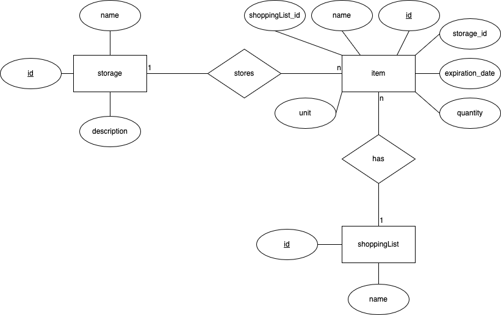

## Installation & Setup

### 1. Installing all dependencies

To install all dependencies type the following into the terminal:

```
npm install
```

or

```
npm i
```

After that you should see the _node_modules_ folder appear in the project files.

### 2. Running the api locally

To start the api and database run the following command in your terminal:

```
npm run start
```

or in developer mode with nodemon:

```
npm run start:dev
```

It should say the following in your terminal window:

```
Look on http://localhost:8080/
```

You can now access the api.

## Commit Guidelines

| Prefix   | Usecase                                                                                         | Example                                                                 |
| -------- | ----------------------------------------------------------------------------------------------- | ----------------------------------------------------------------------- |
| feat     | Implementation of a new feature.                                                                | "feat: add ability to view most popular posts"                          |
| fix      | A bug fix (not a build-process fix).                                                            | "fix: check if file exists before attempting to unlink"                 |
| docs     | Update to project documentation.                                                                | "docs: add detailed installation instructions for Windows"              |
| style    | Update to code formatting.                                                                      | "style: convert from 4 space indentation to 2 spaces"                   |
| refactor | Refactoring of code: A code change that neither fixes a bug nor adds a feature.                 | "refactor: rename ArticleController to PostController"                  |
| test     | Adding or updating tests.                                                                       | "test: add assertions for Collection update and destroy methods"        |
| chore    | Updates to dependencies.                                                                        | "chore: bump mssql-jdbc to v11.2.3.jre17"                               |
| ci       | Updates to CI/CD related files and scripts                                                      | "ci: add test step to test application performance"                     |
| build    | Changes that affect the build system or external dependencies (angular.json, webpack, npm, ...) | "build: set default ChangeDetection to OnPush for component generation" |

## Entity Relationship Model



## Endpoints

| Verb   | URL                         | Description                                                                                                                                                                                           |
|--------|-----------------------------|-------------------------------------------------------------------------------------------------------------------------------------------------------------------------------------------------------|
| GET    | /shopping-list              | Retrieve all shopping lists (Collection).                                                                                                                                                             |
| GET    | /shopping-list/{id}         | Retrieve a shopping list (resource) that has the {id}.                                                                                                                                                |
| GET    | /shopping-list/{id}/items   | Returns all items (collection) of a shopping list (resource) with the {id}.                                                                                                                           |
| POST   | /shopping-list/{id}/items   | Creates a new item (resource) in the shopping list (collection) with the {id}.                                                                                                                        |
| GET    | /shopping-list/1/items/{id} | Returns an item (resource) with the {id} that belongs to the shopping list with ID 1.                                                                                                                 |
| PUT    | /shopping-list/1/items/{id} | Updates an item (resource) with the {id} in shopping list 1 with the fields provided in the request body.                                                                                             |
| PATCH  | /shopping-list/1/items/{id} | Updates an item (resource) with the {id} in shopping list 1 with the fields provided in the request body.                                                                                             |
| DELETE | /shopping-list/1/items/{id} | Deletes an item (resource) with the {id} in shopping list 1.                                                                                                                                          |
| POST   | /shopping-list              | Creates a new shopping list (resource) with the data provided in the request body.                                                                                                                    |
| PUT    | /shopping-list/{id}         | Updates a shopping list (resource) with the {id} using the data provided in the request body. Depending on the configuration, this may also allow creating a new resource with the request body data. |
| PATCH  | /shopping-list/{id}         | Updates an existing shopping list with the {id}. The request body contains only the fields to be overwritten.                                                                                         |
| DELETE | /shopping-list/{id}         | Deletes the shopping list (resource) with the {id}.                                                                                                                                                   |
| GET    | /item                       | Returns all items (collection) that exist.                                                                                                                                                            |
| GET    | /item/{id}                  | Returns the item (resource) with the {id}.                                                                                                                                                            |
| GET    | /item/{id}/shopping-list    | Returns the shopping list (resource) of the item with the {id}.                                                                                                                                       |
| PATCH  | /item/{id}/shopping-list    | Updates the shopping list of the item with the {id} using the fields provided in the request body.                                                                                                    |
| PUT    | /item/{id}/shopping-list    | Updates the shopping list of the item with the {id} using the fields provided in the request body.                                                                                                    |
| DELETE | /item/{id}/shopping-list    | Deletes the shopping list of the item with the {id}.                                                                                                                                                  |
| POST   | /item                       | Creates a new item with the data provided in the request body.                                                                                                                                        |
| PUT    | /item/{id}                  | Updates an item (resource) with the {id} using the data provided in the request body. Depending on the configuration, this may also allow creating a new resource with the request body data.         |
| PATCH  | /item/{id}                  | Updates an existing item with the {id}. The request body contains only the fields to be overwritten.                                                                                                  |
| DELETE | /item/{id}                  | Deletes the item (resource) with the {id}.                                                                                                                                                            |
| GET    | /storage                    | Retrieve all storages (Collection).                                                                                                                                                                   |
| GET    | /storage/{id}               | Retrieve a storage (resource) that has the {id}.                                                                                                                                                      |
| GET    | /storage/{id}/items         | Returns all items (collection) of a storage (resource) with the {id}.                                                                                                                                 |
| POST   | /storage/{id}/items         | Creates a new item (resource) in the storage (collection) with the {id}.                                                                                                                              |
| GET    | /storage/1/items/{id}       | Returns an item (resource) with the {id} that belongs to the storage with ID 1.                                                                                                                       |
| PUT    | /storage/1/items/{id}       | Updates an item (resource) with the {id} in storage 1 with the fields provided in the request body.                                                                                                   |
| PATCH  | /storage/1/items/{id}       | Updates an item (resource) with the {id} in storage 1 with the fields provided in the request body.                                                                                                   |
| DELETE | /storage/1/items/{id}       | Deletes an item (resource) with the {id} in storage 1.                                                                                                                                                |
| POST   | /storage                    | Creates a new storage (resource) with the data provided in the request body.                                                                                                                          |
| PUT    | /storage/{id}               | Updates a storage (resource) with the {id} using the data provided in the request body. Depending on the configuration, this may also allow creating a new resource with the request body data        |
| PATCH  | /storage/{id}               | Updates an existing storage with the {id}. The request body contains only the fields to be overwritten.                                                                                               |
| DELETE | /storage/{id}               | Deletes the storage (resource) with the {id}.                                                                                                                                                         |
| GET    | /item/{id}/storage          | Returns the storage (resource) of the item with the {id}.                                                                                                                                             |
| PATCH  | /item/{id}/storage          | Updates the storage of the item with the {id} using the fields provided in the request body.                                                                                                          |
| PUT    | /item/{id}/storage          | Updates the storage of the item with the {id} using the fields provided in the request body.                                                                                                          |
| DELETE | /item/{id}/storage          | Deletes the storage of the item with the {id}.                                                                                                                                                        |
